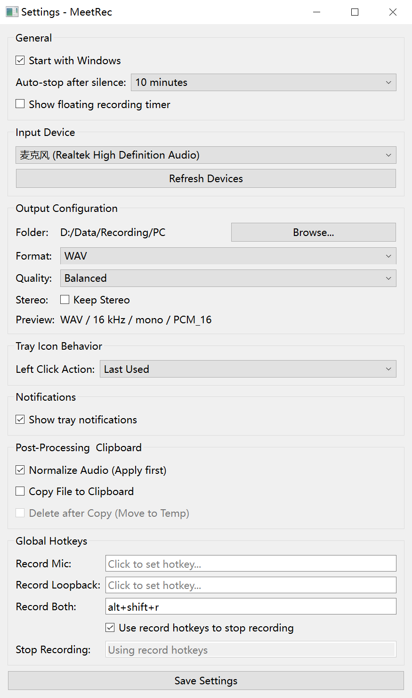

# MeetRec

**MeetRec** is a lightweight Windows tray recorder for meetings, calls, microphone audio, system audio, or both at the same time.
It is designed to stay out of the way: configure it once, then start or stop recordings from the tray icon, a global hotkey, or the floating timer.




## Features

### Recording Sources

- **Microphone**: record the selected input device.
- **System Audio**: record loopback audio from the computer.
- **Both**: record microphone and system audio together, then mix them into one file.

### Output Configuration

- **Formats**: WAV, FLAC, or MP3.
- **Quality**:
  - Balanced: 16 kHz output, PCM_16 for WAV/FLAC, 64 kbps for MP3.
  - High Quality: 48 kHz output, PCM_24 for WAV/FLAC, 128 kbps for MP3.
- **Stereo**: keep stereo channels when needed, or leave it off for mono output.
- **Preview**: the settings window shows the exact output profile, for example `WAV / 16 kHz / mono / PCM_16`.

### Recording Control

- **Tray icon**: left-click starts or stops recording; right-click opens recording actions, the output folder, settings, or exit.
- **Left-click mode**: choose Last Used, Microphone, Loopback, or Both.
- **Global hotkeys**: configure separate hotkeys for microphone, loopback, both, and stop.
- **Record hotkeys stop recording**: when enabled, pressing any record hotkey again stops the active recording.
- **Windows hotkey handling**: supports common combinations such as `alt+shift+r` through a low-level Windows hotkey path.
- **Floating recording timer**: optional always-on-top timer. Click it while recording to stop; after stopping, it stays briefly in a finished state and clicking it opens the recordings folder.

### Automation And Feedback

- **Start with Windows**: optionally launch MeetRec when Windows starts.
- **Auto-stop after silence**: Off, 5 minutes, 10 minutes, or 20 minutes.
- **Tray notifications**: enable or disable tray balloon notifications.
- **Single instance**: launching MeetRec again exits immediately if another instance is already running.

### Post-Processing

- **Normalize Audio**: enabled by default. Performs source leveling before mixing: microphone and system audio are each raised toward a target level using active audio only and a maximum gain cap. This keeps quiet microphone speech intelligible without normalizing long silence or residual noise as the reference.
- **Reduce speaker echo (Both mode)**: enabled by default. Uses system audio as a reference to subtract speaker leakage from the microphone track before denoise, leveling, ducking, and mixing. It only affects Both mode.
- **Reduce microphone noise (RNNoise)**: optional and off by default. Applies conservative RNNoise speech denoising to the microphone track after echo suppression and before leveling, using a 35% wet mix with latency compensation so weak speech is less likely to be removed. Requires `rnnoise.dll`; if the library is unavailable, recording still succeeds and denoising is skipped.
- **Lower system audio while microphone is active**: enabled by default. In Both mode, lowers loopback audio while the microphone track is active so local speech stays intelligible. This is side-chain ducking; it does not affect microphone-only or loopback-only recordings.
- **Silence trim**: optional final post-processing that trims only the start and end silence beyond 5 seconds, applied to the final mixed output rather than the raw sources.
- **Copy File to Clipboard**: copy the completed recording to the clipboard.
- **Delete after Copy (Move to Temp)**: move the file to the temp folder after copying, keeping the output folder clean.

## Usage

1. Start `MeetRec.exe`.
2. Right-click the tray icon and open **Settings**.
3. In **General**, choose startup behavior, whether to show the floating recording timer, and silence auto-stop.
4. In **Input Device**, select the microphone and refresh devices if needed.
5. In **Output Configuration**, choose the folder, format, quality, and stereo mode.
6. In **Tray Icon Behavior**, choose what left-click should record.
7. In **Notifications**, decide whether tray notifications should be shown.
8. In **Post-Processing & Clipboard**, decide whether to use source leveling/normalization, echo reduction, microphone noise reduction, loopback ducking, final edge-silence trim, clipboard copy, or delete-after-copy.
9. In **Global Hotkeys**, set hotkeys and decide whether record hotkeys should stop the active recording.
10. Click **Save Settings**.

## Packaging

The maintained package is an onedir build:

```powershell
pyinstaller --noconfirm MeetRec.spec
```

The output is:

```text
dist\MeetRec\MeetRec.exe
```

Keep the whole `dist\MeetRec` folder together. This package layout avoids the extra onefile bootloader process and lets MeetRec run as a single visible `MeetRec.exe` process.

## Development

### Requirements

- Python 3.12+
- PyQt6
- soundcard
- soundfile
- numpy
- scipy
- lameenc
- keyboard
- pyinstaller

Install the runtime dependencies:

```powershell
pip install -r requirements.txt
```

RNNoise microphone denoising requires `rnnoise.dll` in the repository root when running from source. Build it from `https://github.com/xiph/rnnoise` and copy the resulting DLL to `rnnoise.dll`; `MeetRec.spec` bundles it into the packaged app's internal runtime directory. If the DLL is missing, MeetRec records normally and skips denoising.

Run tests:

```powershell
python -m unittest discover -s tests
```

Build the Windows package:

```powershell
pyinstaller --noconfirm MeetRec.spec
```

## Acknowledgements

MeetRec started from an open-source Windows tray recording project by [lukmay](https://github.com/lukmay). Thanks to the original author and contributors for the initial foundation.
